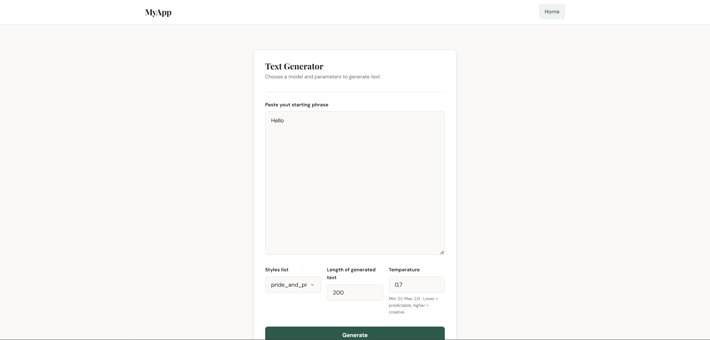
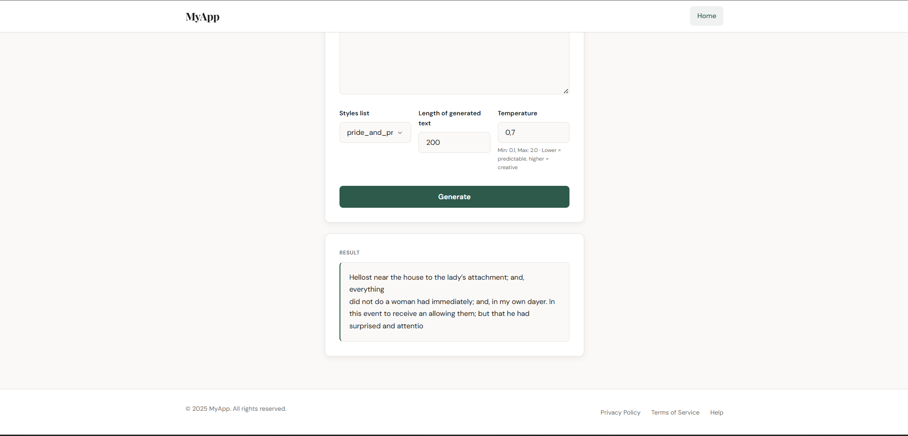

# TextGenerationModel

## Short description
Text generating models, trained on different datasets:
 - **Pride and Prejudice** - https://www.gutenberg.org/files/1342/1342-0.txt
 - **Frankenstein** - https://www.gutenberg.org/files/84/84-0.txt
 - **Sherlock Holmes** - https://www.gutenberg.org/files/1661/1661-0.txt
 - **WikiText2** - https://raw.githubusercontent.com/pytorch/examples/main/word_language_model/data/wikitext-2/train.txt

It's made of 3 components:
 - **text_generation.py**
 - **api**
 - **webapp**


[](https://www.youtube.com/watch?v=BBH8iTkvt3I)

## Setup
  - Python 3.11+
  - ```pip install -r requirements.txt```

## Packages
```
fastapi==0.115.5
Flask==3.1.0
flask_wtf==1.2.2
numpy==1.26.0
pandas==2.0.2
Pillow==10.3.0
pydantic==2.12.5
python-dotenv==1.0.1
Requests==2.32.3
scikit_learn==1.7.2
tensorflow==2.17.0
tensorflow_intel==2.17.0
uvicorn==0.32.0
WTForms==3.2.1
```

## Project Structure
```
│   config.py
│   custom_decorators.py
│   custom_logger.py
│   model_definition.py
│   README.md
│   requirements.txt
│   text_generation.py
├───ocr_api/
│   ├───__init__.py
│   ├───routes.py
│   └───uvicorn_log_config.json
├───logs/
├───models/
│   ├───pride_and_prejudice/
│   ├───shakespear/
│   ├───sherlock_holmes/
│   ├───wikitext2_35/
│   └───wikitext2_full/
├───webapp
│   ├───static
│   │   └───styles/
│   ├───templates/
│   ├───__init__.py
│   ├───.env
│   ├───forms.py
│   ├───routes.py
│   └───run.py

```

## Model architecture

CharRNN is a character-level recurrent neural network designed for text generation. It learns patterns in text at the character level and can generate new text one character at a time.

### 1. Embedding Layer

- Converts character indices into dense vector representations
- Default dimension: 128
- Each character in the vocabulary has its own learned embedding vector

### 2. LSTM Stack

- Default configuration: 2 layers with (128, 64) units
- Each LSTM layer is configured with:
  - `return_sequences=True` — outputs for every timestep
  - `return_state=True` — returns hidden state (h) and cell state (c)
  - `dropout=0.4` — regularization to prevent overfitting

### 3. Dense Output Layer

- Size: `vocab_size` (one logit per possible character)
- Produces probability distribution over the next character

## Data Flow

### Training Mode (`call` method)

```
input → Embedding → LSTM₁ → LSTM₂ → Dense → logits
```

Processes entire sequences, returning predictions for each position.

### Generation Mode (`generate_step` method)

```
input + previous_states → Embedding → LSTM₁ → LSTM₂ → Dense → logits + new_states
```

Key difference: accepts and returns LSTM states, enabling the model to "remember" context without reprocessing the entire sequence.

## Text Generation Process

1. **Initial step**: Process the entire start string, obtain first prediction and states
2. **Subsequent steps**: Feed only the last generated character + previous states
3. **Sampling**: Use `tf.random.categorical` to sample from the probability distribution

### Temperature Parameter

Controls the randomness of generation:

| Temperature | Behavior |
|-------------|----------|
| 0.5 | More predictable, conservative choices |
| 1.0 | Balanced (default) |
| 2.0 | More random, creative but less coherent |

## Example Generation Flow

```
START: "Hello"

Iteration 1: "Hello" → Model → ' '  → "Hello "
Iteration 2: ' ' + states → Model → 'w' → "Hello w"
Iteration 3: 'w' + states → Model → 'o' → "Hello wo"
...
RESULT: "Hello world! This is generated..."
```

## Key Design Decisions

- **Stateful generation**: LSTM states carry context forward, making generation efficient
- **Sampling vs argmax**: Random sampling produces more diverse, natural-sounding text
- **Multi-layer LSTM**: Deeper networks can capture more complex patterns in text


```python
import tensorflow as tf


"""
    Character-level RNN for text generation.
    
    How generation works:
    
    START: “Hello”
    
    Iteration 1:
      Input: “Hello” → Model → Predictions for each position
      We take the last [-1] → Probabilities of the next character
      We draw: ‘ ’
      Result: “Hello ”
    
    Iteration 2:
      Input: ‘ ’ (+ hidden states) → Model → Prediction
      We draw: 'w'
      Result: “Hello w”
    
    Iteration 3:
      Input: ‘w’ (+ hidden states) → Model → Prediction
      We draw: ‘o’
      Result: “Hello wo”
    
    ...and so on until generation_length...
    
    RESULT: "Hello world! This is generated..."
    
    Key points:
    - The first iteration processes the entire start_string
    - Subsequent iterations: only 1 character + hidden states from the previous step (the model “remembers” the context through LSTM states, not by reprocessing the entire text).
    - Temperature controls randomness (lower = more predictable)
"""

class CharRNN(tf.keras.Model):
    def __init__(self,
                 char_to_idx: dict,
                 idx_to_char: dict,
                 vocab_size: int,
                 embedding_dim: int = 128,
                 rnn_units: int = 256,
                 num_layers: int = 2):
        super().__init__()

        self.char_to_idx = char_to_idx
        self.idx_to_char = idx_to_char
        self.embedding = tf.keras.layers.Embedding(vocab_size, embedding_dim)
        self.num_layers = num_layers

        self.lstm_layers = []
        for i, rnn_unit in zip(range(num_layers), rnn_units):
            self.lstm_layers.append(
                tf.keras.layers.LSTM(
                    rnn_unit,
                    return_sequences=True,
                    return_state=True,
                    dropout=0.4
                )
            )

        self.dense = tf.keras.layers.Dense(vocab_size)

        self._built = True

    def call(self, inputs, training=False):
        """for training"""
        x = self.embedding(inputs, training=training)
        for lstm in self.lstm_layers:
            x, _, _ = lstm(x, training=training)
        return self.dense(x, training=training)

    def generate_step(self, inputs, states=None):
        """for generating"""
        x = self.embedding(inputs, training=False)

        all_states = []
        for i, lstm in enumerate(self.lstm_layers):
            if states:
                h_idx = i * 2
                c_idx = i * 2 + 1
                if c_idx < len(states):
                    layer_states = [states[h_idx], states[c_idx]]
                else:
                    layer_states = None
            else:
                layer_states = None

            x, h, c = lstm(x, initial_state=layer_states)
            all_states.extend([h, c])

        return self.dense(x), all_states

    def build(self, input_shape):
        """
        prevent:
        'UserWarning: `build()` was called on layer 'char_rnn_7', however the layer does not have a `build()` method implemented and it looks like it has unbuilt state'
        """
        if self._built:
            return

        super().build(input_shape)

        # Simulate forward pass to build layers
        # Use dummy input with the correct shape
        batch_size = input_shape[0] or 1
        seq_len = input_shape[1] or 10

        dummy_input = tf.zeros((batch_size, seq_len), dtype=tf.int32)

        # Pass through the layers to build them
        x = self.embedding(dummy_input)
        for lstm in self.lstm_layers:
            x, _, _ = lstm(x)
        self.dense(x)

        self._built = True


    def generate(self, start_string: str, generation_length: int = 100, temperature: float = 1.0) -> str:
        """
        Generates text character by character

        temperature: controls “creativity”
        - 0.5 = more predictable
        - 1.0 = balanced
        - 2.0 = more random
        """

        # Convert start string to indexes
        input_eval = [self.char_to_idx[s] for s in start_string]
        input_eval = tf.expand_dims(input_eval, 0)

        generated = []
        states = None

        for i in range(generation_length):
            predictions, states = self.generate_step(input_eval, states=states)

            # Remove batch dim
            predictions = tf.squeeze(predictions, 0)
            # Use last prediction
            predictions = predictions[-1, :] / temperature

            # Sample from distribution (not argmax!)
            # Sample from distribution will draw an additional character based on softmax
            # Randomly pick next char (higher logit = higher chance)
            predicted_id = tf.random.categorical(
                tf.expand_dims(predictions, 0),
                num_samples=1
            )[-1, 0].numpy()

            # The next input is the generated character
            input_eval = tf.expand_dims([predicted_id], 0)

            generated.append(self.idx_to_char[predicted_id])

        return start_string + ''.join(generated)

```

## Text generating module
Text generating module (`text_generation.py`) which works as a simple interface for loading models and generating text.

| Attribute | Type | Default | Description |
|-----------|------|---------|-------------|
| `models_folder` | `Union[Path, str]` | - | Path to the models folder |


### Methods

**load_model** - method for loading model, loading model's artifacts and creating an instance. On post init it reads folder with models.

#### **Parameters:**
 - `model_name`: `str`

#### **Returns:**
 - `CharRNN` - loaded model

### Example
```python
text_gen = TextGenerating(
    models_folder=Config.MODELS_FOLDER
)
model = text_gen.load_model("pride_and_prejudice")
for temp in [.8]:
    print(f"\nTemperature = {temp}:")
    generated = model.generate(
        start_string="Are you ready",
        generation_length=100,
        temperature=temp
    )
    print(generated)
```

## Api
Yes, api

### On initialization
Setuping logger and stuff, but what's more important - loading models.
```python
models = {}
for model_name in text_gen.available_models:
    try:
        models[model_name] = text_gen.load_model(model_name=model_name)
    except Exception as e:
        models[model_name] = None
        logger.error(f"Error in initing model: {model_name=}", exc_info=True)
```
### Routes

 - **alive (/)**
    <br>

    Response:
    ```json
    {
        "status": {
            "pride_and_prejudice": {
            "status": "Loaded"
            },
            "shakespear": {
            "status": "Loaded"
            },
            "sherlock_holmes": {
            "status": "Loaded"
            },
            "wikitext2_35": {
            "status": "Loaded"
            },
            "wikitext2_full": {
            "status": "Loaded"
            }
        }
    }
    ```

 - **health_check (/health)** - checks state of the models (loaded or not)
 - **gen_text (/gen_text)** - generating text.
    <br>
    Scheme:
    ```json
    {
    "model_name": "string",
    "start_phrase": "string",
    "generation_length": 10,
    "temperature": 0.1
    }
    ```
    <br>
    Response:

    ```json
    {
    "model_name": "pride_and_prejudice",
    "res_text": "hellow her to be sure, and the street who had been a strong attentions to the present distress of the fol",
    "generation_length": 100,
    "temperature": 0.1
    }
    ```

 - **gen_text_bulk (/gen_text_bulk)** - bulk text generation.
    <br>

    Scheme:

    ```json
    {
    "inputs": [
        {
            "model_name": "pride_and_prejudice",
            "start_phrase": "hello",
            "generation_length": 100,
            "temperature": 0.1
        },
        {
            "model_name": "wikitext2_full",
            "start_phrase": "hello",
            "generation_length": 100,
            "temperature": 0.1
        }
    ],
    "ignore_errors": false
    }
    ```

    <br>
    Response:

    ```json
    {
    "results": [
        {
            "model_name": "pride_and_prejudice",
            "res_text": "hellost and so much as they were all the street, and the contents of her father was a strong attentions t",
            "generation_length": 100,
            "temperature": 0.1
        },
        {
            "model_name": "wikitext2_full",
            "res_text": "hellow and the state of the state of the community of the state of the state of the company 's first time",
            "generation_length": 100,
            "temperature": 0.1
        }
    ],
    "ignore_errors": false
    }

    ```

## Web app

### On initialization
Checking what models are available with `/health`.



